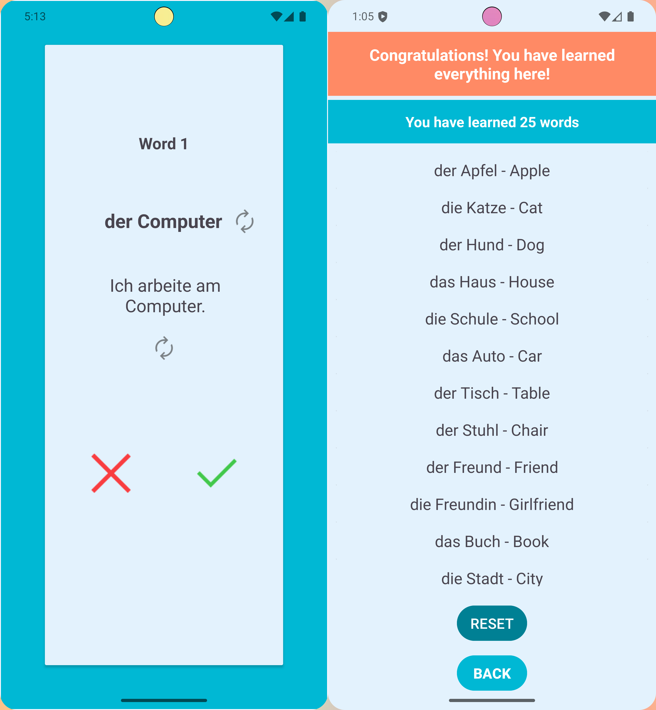
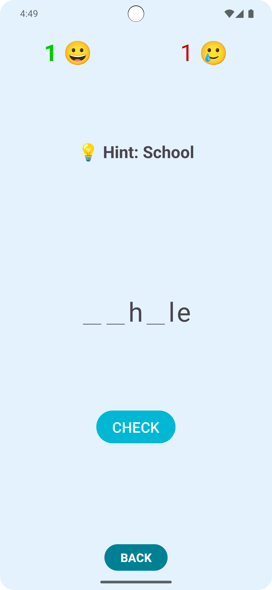
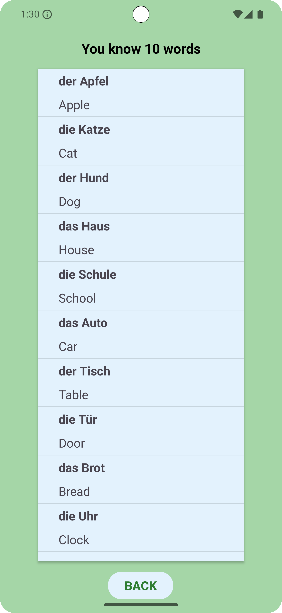

## Sprax - Vocabulary Learning App

  

**Sprax** is an Android app that helps German learners build vocabulary through a fun and interactive guessing game. Lessons are organized by level (A1–B1), and the app includes pronunciation playback, progress tracking, quick reviews, and gradual learning — all wrapped in a clean, user-friendly interface.

**This project showcases my journey into mobile development, applying theoretical knowledge into real-world app development.**

## ✨ Features

**Vocabulary Lessons** - Learn German vocabulary using flashcards with meanings, example sentences, images, and audio for pronunciation.

**Progress Tracking** - Track your known and unlearned words, with the option to reset lessons for further practice.

  

**Guessing Quiz** - Strengthen vocabulary retention through a fun and interactive guessing game.

  

**Summary View** - Quickly review the words you've learned from each session.

  

**Room Database Integration** - Store vocabulary locally, enabling offline access and persistent progress tracking.

**Clean and Modular Codebase** - Activities, adapters, and database operations are organized for maintainability and scalability.

## 🛠️ Technologies Used

**Java** — Core application logic

**Android Studio** — Development environment

**RecyclerView** — Displaying dynamic lists

**Room Database** — Local storage for vocabulary and progress

**Gson** — Parsing JSON data for vocabulary

**Media** — Handling image display and audio playback using MediaPlayer

**Multi-threading** — Managing background tasks and UI updates

**Material Design** — Simple, user-friendly interface

## 💡 How I Built It

This project was developed as part of my Android learning journey, combining:

Self-learning through documentation and tutorials

Practical experimentation

Help from community knowledge (e.g., StackOverflow)

It also builds upon my experience creating a German learning website, expanding my Java knowledge to mobile development.

## 📈 Future Improvements

Multiple-choice quizzes

"Der/Die/Das" guessing game

## 📖 What I Learned

Connecting activities using Intents

Managing dynamic lists with RecyclerView and custom ViewHolders

Storing and managing data locally with Room

Parsing JSON files with Gson

Updating the UI safely from background threads

Structuring code for scalability and readability

## 📂 Project Status

> ⚠️ **Disclaimer**: This project is a completed showcase of my early Android development skills. I'm moving on to new projects to further expand my portfolio.

🌟 Thank you for reading!
